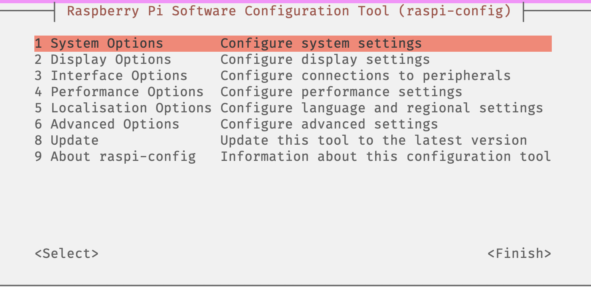
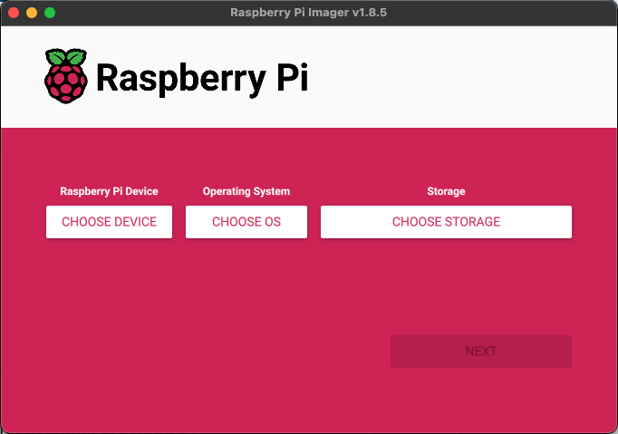
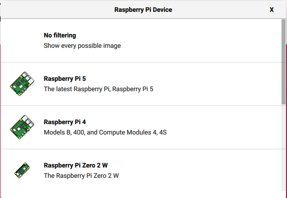
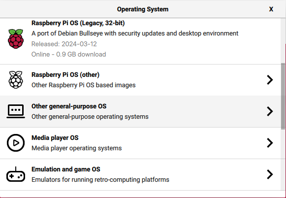
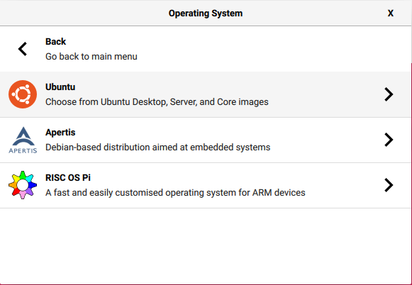
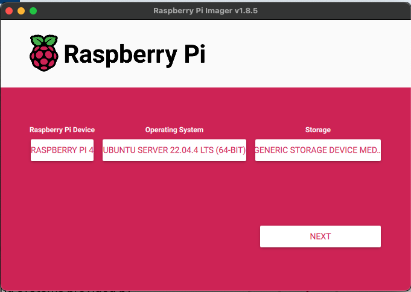
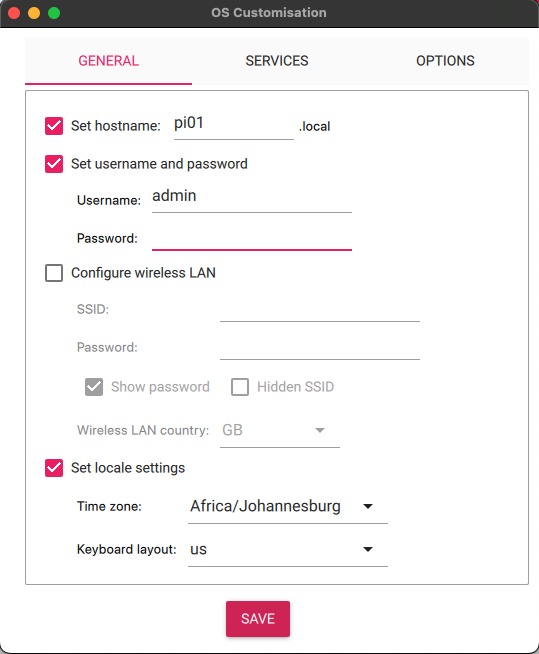
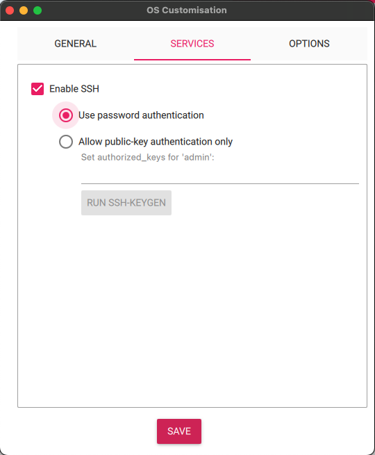

## How to bake an Ortelius Pi Part 1 | The Hardware

#### Introduction

I recently started building an entire Cloud Native environment on three Raspberry Pi 4 B's with an old Synology DS413j (ARMv5 architecture) running the latest firmware update DSM 6.2.4-25556 Update 7 [Release Notes](https://www.synology.com/en-af/releaseNote/DSM) and so far its been quite a journey. In this blog post I would like to share my undertakings in a series of blog posts. First I will cover the Raspberry Pi hardware, NFS and setup and then move on to [Canonicals MicroK8s](https://microk8s.io/) (Kubernetes), [Traefik](https://doc.traefik.io/traefik/) (Cloud Native Proxy and Load Balancer), [Netdata](https://www.netdata.cloud/) for observability, [ArgoCD](https://argo-cd.readthedocs.io/en/stable/), [DevPod](https://devpod.sh/)(Loft Labs) [LocalStack](https://www.localstack.cloud/) (AWS Cloud at home) and [Ortelius](https://ortelius.io/) the ultimate evidence store.

Why Raspberry Pi's you ask, well first of all I live in Cape Town South Africa where we are experiencing some of the worst electricity outages in years thus we need to share electricity by taking turns through rotational blocks of time commonly know to locals as Load Shedding. We use an app like this one [Load Shedding App](https://play.google.com/store/apps/details?id=com.abisoft.loadsheddingnotifier&hl=en_ZA&gl=US) to inform ourselves when the next bout of load shedding will be hitting our area. Raspberry Pi 4 B's pack a punch with a Broadcom Quad Core ARMv8 processor and 8 GB ram. They are very light on electricy thus saving on cost and only require a single small UPS (uninterruptable power supply) to stay online. They are very mobile and take up extremely little space in my man cave.

#### My Home Setup
- 3X [Raspberry Pi4 Model B 8GB Red/White Official Case Essentials Kit Boxed White Power Supply](https://www.pishop.co.za/store/custom-kits/raspberry-pi4-model-b-8gb-redwhite-official-case-essentials-kit-boxed-white-power-supply)
- Please go to this link for the full hardware specs [Raspberry Pi 4 B](https://www.raspberrypi.com/products/raspberry-pi-4-model-b/specifications/)


-------------------------------------------------------------------------------------------------------------
- 3X 32GB Samsung Evo+ Micro SD Card (UHS-II: theoretical maximum transfer speeds up to 312MB/s) | Speed chart [here](https://www.kingston.com/en/blog/personal-storage/memory-card-speed-classes)
- Speed chart [here](https://www.kingston.com/en/blog/personal-storage/memory-card-speed-classes)
- I used this [article](https://www.jeffgeerling.com/blog/2019/raspberry-pi-microsd-card-performance-comparison-2019) by Jeff Geerling whom I can thoroughly recommend for all things Pi to choose my SD cards

`OR`

- 3X 32GB USB 3 flash drives but this comes with some caveats performance wise which I will discuss further on
-------------------------------------------------------------------------------------------------------------
- 1X Screen HDMI
- 1X Keyboard USB
- 1X [KVM Switch device](https://www.amazon.com/3-port-kvm-switch/s?k=3+port+kvm+switch)
- 1X 8 Port Switch
- Networking | Use [DHCP](https://www.youtube.com/watch?v=ldtUSSZJCGg) or [static IP addresses](https://www.pcmag.com/how-to/how-to-set-up-a-static-ip-address) in a [private range](https://www.lifewire.com/what-is-a-private-ip-address-2625970).
- 1X UPS (Uninterruptable Power Supply) for the Pi's and switch | Something like this [Mecer 650VA](https://mecer.co.za/mecer-line-interactive-ups/). Please note this is a South African brand of UPS but I am showing this for example purposes. The Mecer brand is extremely good and all my lead acid battery UPS's are from Mecer. I have a combination of the 650VA, 2000VA and 3000VA to keep me going (7 in all)

#### NFS Storage
- 1X NAS device for the NFS storage which can be a virtual machine, laptop, old desktop or Synology type device. There are plenty options out there just do a internet search.
- 1X 650VA UPS

#### Raspberry Pi Imaging Utility for the Ubuntu 22.04 LTS x64 OS installation

The imaging utility will be used install Ubuntu onto your SD Card or USB flash drive.
- [Raspberry Pi imaging Utility](https://www.raspberrypi.com/software/)
- [Ubuntu Server 22.04 LTS x64 for Raspberry Pi](https://ubuntu.com/download/raspberry-pi)
- MacOS install with Brew package manager ```brew install raspberry-pi-imager```
- Windows install [here](https://downloads.raspberrypi.org/imager/imager_latest.exe)

#### Step 1 | Preparing the OS for installation

#### USB 3 flash drives

If you use USB flash drives you will need to do the following as mentioned in this [post](https://forums.raspberrypi.com/viewtopic.php?f=28&t=245931). It all comes down to the implementation of the UAS specification.

- In the article the author says to go here `/boot/cmdline.txt` but on my Pi4 I had to go here `/boot/firmware/cmdline.txt`
- A Pi has no BIOS so this is how you configure a Pi's BIOS by editing `/boot/firmware/cmdline.txt`
- Install Raspi-Config on each Ubuntu server `sudo apt install raspi-config -y`
- Raspi-Config allows you to configure your Pi's hardware without having to fiddle with `/boot/firmware/cmdline.txt`
- Run Raspi-Config like this `sudo raspi-config` and you will get a screen like this
- Use Raspi-Config to configure boot order, remove or add read-only filesystem and many other tweaks



---------------------------------------------------------------------------------------------------

- Repeat these steps for each SD Card or USB flash stick
- The opening screen will present you with `CHOOSE DEVICE` | `CHOOSE OS` | `CHOOSE STORAGE`
- Choose Device



- Choose `Raspberry Pi4 models B, 400 and Compute Modules 4, 4s`



- Choose `OS`
- Choose `Other general-purpose OS`



- Choose `Ubuntu`



- Choose `Ubuntu Server 22.04.4 LTS (64-bit)`


- Choose Storage
- This will look different on your machine


- Click Next



- Use OS Customisation by clicking on `EDIT SETTINGS`


- Fill in the required info according to your specifications
- Remember to change the `HOSTNAMES` `pi01` | `pi02` | `pi03` (You can use whatever hostnames make sense to you)




- Check the boxes that make sense to you


- Click `YES` to apply the OS customisation settings


- Rinse and repeat 3 times

#### Conclusion

By this stage you should have three Pi 4 B's running with Ubuntu 22.04.4 LTS. Stay tuned for part 2 where we will dive into optimising USB flash sticks for the best performance and stability and the installation of MicroK8s.

#### Disclaimer: Any brands I mention in this blog post series are not monetised. This is my home setup!
