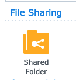

## How to bake an Ortelius Pi Part 2 | The Preparation

#### Introduction

In the first [part](https://ortelius.io/blog/2024/03/27/how-to-bake-an-ortelius-pi-part-1-the-hardware/) of this series we prepped our Raspberry Pi 4's for the installation of Ubuntu 22.04.4 LTS. In part 2 we will prepare our three Pi's for NFS (Network File System) storage with a Synology NAS and install MicroK8s [MicroK8s](https://microk8s.io/).

#### OS Prep
- SSH into each Pi like this `ssh admin@192.168.0.1`
- Update all packages to the latest with `sudo apt update -y && sudo apt upgrade -y` then go and make coffee
- then `sudo vi /boot/firmware/cmdline.txt`
- Add the following `cgroup_enable=memory cgroup_memory=1`
- Kernel Modules installation `sudo apt install linux-modules-extra-raspi`
- Referenced from [here](https://microk8s.io/docs/install-raspberry-pi)
- then install `sudo apt install nfs-common -y`

#### NFS Prep

I am using a Synology DS413j with DSM 6.2.4-25556 Update 7 so the following steps will be inline with my Synology

#### Enable NFS
- Login to the Synology and go to `File Services`

- On the `SMB/AFP/NFS` tab and scroll until you see `NFS` and `enable NFS and enable NFSv4 support`

#### Configure Shared Folder
- Go to `File Sharing`

- Click `Create`

- Create a name for your folder share, I used `Pi8s`

- Skip encryption
- Apply your config

- Right click your newly created `Shared Folder` and select `Edit`

- Select `Permissions` tab

- Select `Local users`drop down and give the  `admin` `Read/Write` permissions by checking the box

- Select `NFS Permissions` and then `Create`

- Configure like this click `OK`

#### Conclusion

By this stage you should have three Pi 4 B's running with Ubuntu 22.04.4 LTS and MicroK8s. Stay tuned for part 3 where we will dive into optimising USB flash sticks for the best performance and stability and the installation of MicroK8s.

#### Disclaimer: Any brands I mention in this blog post series are not monetised. This is my home setup!
