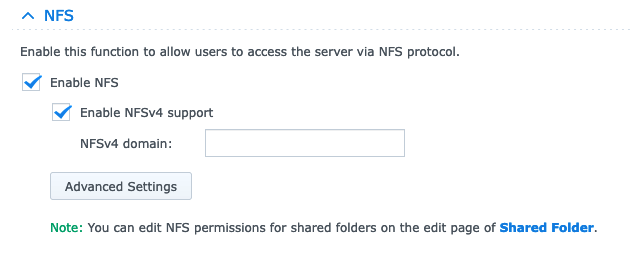
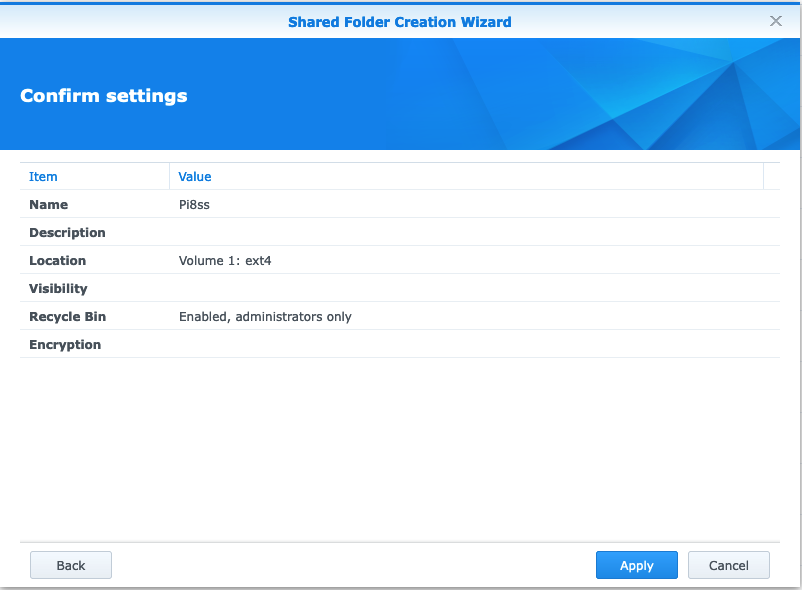

## How to bake an Ortelius Pi Part 2 | The Preparation

#### Introduction

In [part 1](https://ortelius.io/blog/2024/03/27/how-to-bake-an-ortelius-pi-part-1-the-hardware/) of this series we prepped our Raspberry Pi 4's for the installation of Ubuntu 22.04.4 LTS. In part 2 we will prepare our three Pi's for NFS (Network File System) storage with a Synology NAS and install MicroK8s [MicroK8s](https://microk8s.io/).

#### DNS

For DNS I use [NextDNS](https://nextdns.io/) but this is not just DNS its complete protection for all your devices (mobiles, tablets, routers, home internet, NAS devices, laptops and desktops) including your Pi MicroK8s nodes.

If you are using NextDNS do the following
- Go [here](https://github.com/nextdns/nextdns/wiki) - You will find usage instruction here too
- Install the cli on each Pi and on your NAS
```
sh -c 'sh -c "$(curl -sL https://nextdns.io/install)"'
```


#### OS Prep
- Install Kubectl [here](https://kubernetes.io/docs/tasks/tools/) on your local machine
- Install Helm [here](https://helm.sh/) on your local machine
- SSH into each Pi like this `ssh <your username>@<your ip address>` and your password
- Update all packages to the latest with `sudo apt update -y && sudo apt upgrade -y` then go and make coffee

#### NFS Prep

I am using a Synology DS413j with DSM 6.2.4-25556 Update 7 so the following steps will be inline with my Synology
- Install `sudo apt install nfs-common -y` for each Pi

#### Enable NFS on the Synology
- Login to the Synology and go to `File Services`


- On the `SMB/AFP/NFS` tab and scroll until you see `NFS` and `enable NFS and enable NFSv4 support`




#### Configure Shared Folder
- Go to `File Sharing`


- Click `Create`


- Create a name for your folder share, I used `Pi8s`


- Skip encryption
- Apply your config



- Right click your newly created `Shared Folder` and select `Edit`


- Select `Permissions` tab


- Select `Local users`drop down and give the  `admin` `Read/Write` permissions by checking the box


- Select `NFS Permissions` and then `Create`


- Configure like this then click `OK`


- Congrats you just configured the Synology for NFS!

#### MicroK8s Prep
- [MicroK8s docs](https://microk8s.io/docs)
- Configure Pi BIOS `sudo vi /boot/firmware/cmdline.txt` and add the following `cgroup_enable=memory cgroup_memory=1`
- Below is the config from my Pi
```
cgroup_enable=memory cgroup_memory=1 console=serial0,115200 dwc_otg.lpm_enable=0 console=tty1 root=LABEL=writable rootfstype=ext4 rootwait fixrtc quiet splash
```
- Install Kernel Modules `sudo apt install linux-modules-extra-raspi`
- Referenced from [here](https://microk8s.io/docs/install-raspberry-pi)
- Install Microk8s on each Pi
```
sudo snap install microk8s --classic
```
- This installs the latest version of Microk8s

#### MicroK8s create highly available 3 node cluster
- Choose a Pi to start the process, I used `pi01`
- SSH onto `pi01` and run this command on `pi01`
```
sudo microk8s add-node
```
- This will return some joining instructions which should be executed on the MicroK8s instance that you wish to join to the cluster `(NOT THE NODE YOU RAN add-node FROM)`
```
From the node you wish to join to this cluster, run the following:
microk8s join 192.168.1.230:25000/92b2db237428470dc4fcfc4ebbd9dc81/2c0cb3284b05

Use the '--worker' flag to join a node as a worker not running the control plane, eg:
microk8s join 192.168.1.230:25000/92b2db237428470dc4fcfc4ebbd9dc81/2c0cb3284b05 --worker

If the node you are adding is not reachable through the default interface you can use one of the following:
microk8s join 192.168.1.230:25000/92b2db237428470dc4fcfc4ebbd9dc81/2c0cb3284b05
microk8s join 10.23.209.1:25000/92b2db237428470dc4fcfc4ebbd9dc81/2c0cb3284b05
microk8s join 172.17.0.1:25000/92b2db237428470dc4fcfc4ebbd9dc81/2c0cb3284b05
```
- Referenced from [here](https://microk8s.io/docs/clustering)

#### CSI Driver NFS installation for Kubernetes


#### Conclusion

By this stage you should have three Pi's each running with NFS and MicroK8s installed. Stay tuned for part 3 where we will install the `csi-driver-nfs` for Kubernetes

#### Disclaimer: Any brands I mention in this blog post series are not monetised. This is my home setup!
