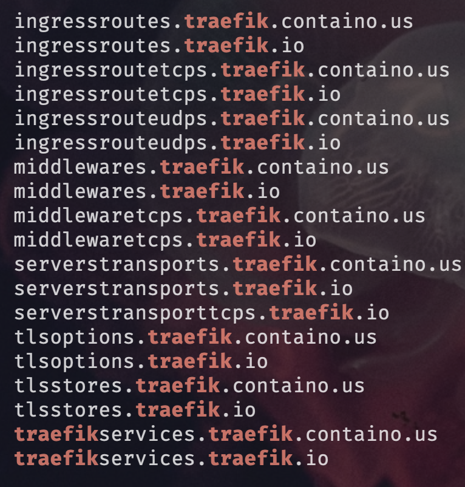
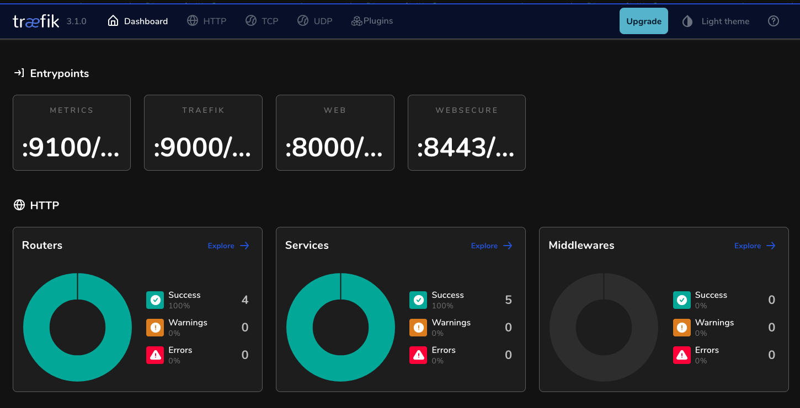

## How to bake an Ortelius Pi Part 3 | The Configuration

### Introduction

In [Part 2](https://ortelius.io/blog/2024/03/27/how-to-bake-an-ortelius-pi-part-2-the-preperation/), of this series we configured DHCP, DNS, NFS and deployed MicroK8s. In Part 3 we will deploy the [NFS CSI Driver](https://github.com/kubernetes-csi/csi-driver-nfs) for Kubernetes to connect to the Synology NAS for centralised storage, deploy [MetalLB load-balancer](https://metallb.universe.tf/), deploy [Traefik Proxy](https://traefik.io/) as the entrypoint for our Microservices and deploy [Ortelius](https://ortelius.io/) the ultimate evidence store.

We will be using Helm Charts to configure some of our services as this makes getting going a lot easier. Also Helm Charts are great to compare your configuration or reset your `values.yaml` in case you totally lose the plot. Think of `values.yaml` as the defaults for the application you are deploying.

### NFS CSI Driver

With the [NFS CSI Driver](https://github.com/kubernetes-csi/csi-driver-nfs) we will use Kubernetes to dynamically manage the creation and mounting of persistent volumes to our pods using the Synology NAS as the central storage server.

- Kubectl quick reference [here](https://kubernetes.io/docs/reference/kubectl/quick-reference/)
- Helm quick reference guide [here](https://helm.sh/docs/intro/cheatsheet/)
- Helm Chart reference [here](https://github.com/kubernetes-csi/csi-driver-nfs/tree/master/charts)
- Kubernetes Storage Class docs [here](https://kubernetes.io/docs/concepts/storage/storage-classes/)
- [What is network-attached storage (NAS)?](https://www.purestorage.com/knowledge/what-is-nas.html)
- An excellent blog written by Rudi Martinsen on the NFS CSI Driver with step-by-step instructions for reference [here](https://rudimartinsen.com/2024/01/09/nfs-csi-driver-kubernetes/)

---------------------------------------------------------------------------------------------------------------

- On your local machine open your favourite terminal
- Switch to the `kube-system` namespace

```
kubectl config set-context --current --namespace=kube-system
```

- Helm repo add

```
helm repo add csi-driver-nfs https://raw.githubusercontent.com/kubernetes-csi/csi-driver-nfs/master/charts
```

- Helm repo update

```
helm repo update
```

- Helm repo install

```
helm install csi-driver-nfs csi-driver-nfs/csi-driver-nfs --namespace kube-system --version v4.6.0 \
  --set controller.dnsPolicy=ClusterFirstWithHostNet \
  --set node.dnsPolicy=ClusterFirstWithHostNet \
  --set kubeletDir="/var/snap/microk8s/common/var/lib/kubelet" # The Kubelet has permissions at this location to mount the NFS shares
```

- Kubectl show me the pods

```
kubectl get pods
```


- Now lets create a Storage Class to be used for central data access between our nodes and pods
- Create a file called `nfs-setup.yaml`, copy the YAML below and run `kubectl apply -f nfs-setup.yaml`

```
apiVersion: storage.k8s.io/v1
kind: StorageClass
metadata:
  name: nfs-csi-default
provisioner: nfs.csi.k8s.io
parameters:
  server: <your nfs server ip goes here>
  share: /volume4/pi8s/
  # csi.storage.k8s.io/provisioner-secret is only needed for providing mountOptions in DeleteVolume
  # csi.storage.k8s.io/provisioner-secret-name: "mount-options"
  # csi.storage.k8s.io/provisioner-secret-namespace: "default"
allowVolumeExpansion: true
reclaimPolicy: Delete
volumeBindingMode: Immediate
mountOptions:
  - nfsvers=4
```

- Kubectl show me the Storage Class

```
kubectl get sc
```


- Lets make this the default Storage Class as in the above image

```
kubectl patch storageclass nfs-csi -p '{"metadata": {"annotations":{"storageclass.kubernetes.io/is-default-class":"true"}}}'
```

- If you want to undo making it the default Storage Class

```
kubectl patch storageclass nfs-csi -p '{"metadata": {"annotations":{"storageclass.kubernetes.io/is-default-class":"false"}}}'
```

- Great we now have Kubernetes managing NFS volume mounts dynamically for us to our NAS (Network Attached Storage)!

### MetalLB load-balancer for bare metal Kubernetes

With MetalLB we will setup a unique IP address on our home network to expose the Microservices running in our Kubernetes cluster. A public cloud provider would give you this during the deployment of your Kubernetes cluster but since we are the cloud we need to provide it and thats where [MetalLB](https://metallb.universe.tf/) comes in.

- Kubectl quick reference [here](https://kubernetes.io/docs/reference/kubectl/quick-reference/)
- Helm quick reference guide [here](https://helm.sh/docs/intro/cheatsheet/)
- Helm Chart on ArtifactHub [here](https://artifacthub.io/packages/helm/metallb/metallb)
- MetalLB concepts [here](https://metallb.universe.tf/concepts/)

---------------------------------------------------------------------------------------------------------------

- Choose an IP address on your private home network that does not fall inside your DHCP pool for MetalLB to use
- Helm repo add

```
helm repo add metallb https://metallb.github.io/metallb
```

- Helm repo update

```
helm repo update
```

- Helm install MetalLB in the `metallb-system` namespace

```
helm install metallb metallb/metallb -n metallb-system
```

- Kubectl switch to the `metallb-system` namespace

```
kubectl config set-context --current --namespace=metallb-system
```

- Kubectl show me the MetalLB pods in the `metallb-system` namespace

```
kubectl get pods
```


- Now lets enable [L2 Advertisement](https://metallb.universe.tf/troubleshooting/) and setup our IP pool
- Copy the YAML below into `metallb-setup.yaml` and run `kubectl apply -f metallb-setup.yaml`

```
apiVersion: metallb.io/v1beta1
kind: IPAddressPool
metadata:
  name: default-pool
  namespace: metallb-system
spec:
  addresses:
  - 192.168.0.151-192.168.0.151 # change this to your private ip
---
apiVersion: metallb.io/v1beta1
kind: L2Advertisement
metadata:
  name: default-pool
  namespace: metallb-system
spec:
  ipAddressPools:
  - default-pool
```

- The `ipaddresspools.metallb.io` is a [CRD](https://kubernetes.io/docs/tasks/extend-kubernetes/custom-resources/custom-resource-definitions/) which is a custom resource created in our Kubernetes cluster that adds additional magic
- Kubectl show me all CRDs for MetalLB

```
kubectl get crds | grep metallb
```


- Kubectl show me the IP address pools for MetalLB

```
kubectl get ipaddresspools.metallb.io
```


- Epic we have a working load balancer for our Kubernetes cluster on a single IP address which means a single gate into our Kubernetes cluster which we can control with Traefik Proxy

### Traefik the Cloud Native Proxy

With [Traefik Proxy](https://traefik.io/) we can now direct traffic destined for our Microservices into the Kubernetes cluster and protect our endpoints using a combination of entrypoints, routers, services, providers and middlewares.

- Kubectl quick reference [here](https://kubernetes.io/docs/reference/kubectl/quick-reference/)
- Helm quick reference guide [here](https://helm.sh/docs/intro/cheatsheet/)
- Traefik docs [here](https://doc.traefik.io/traefik/)
- Traefik [EntryPoints](https://doc.traefik.io/traefik/routing/entrypoints/)
- Traefik [Routers](https://doc.traefik.io/traefik/routing/routers/)
- Traefik [Services](https://doc.traefik.io/traefik/routing/services/) can be divided into two groups `Traefik Services` and `Kubernetes Services`
- Traefik [Providers](https://doc.traefik.io/traefik/routing/providers/kubernetes-crd/)
- Traefik Helm Chart on ArtifactHub [here](https://artifacthub.io/packages/helm/traefik/traefik)

---------------------------------------------------------------------------------------------------------------

- Helm repo add

```
helm repo add traefik https://traefik.github.io/charts
```

- Kubectl create the Traefik namespace

```
kubectl create ns traefik-v2
```

- Kubectl switch to the traefik-v2 namespace

```
kubectl config set-context --current --namespace=traefik-v2
```

- Helm repo update

```
helm repo update
```

- Helm install Traefik

```
helm install traefik traefik/traefik --namespace=traefik-v2
```

- Kubectl show me the pods for Traefik

```
kubectl get pods
```


- Using GitHub fork the [Traefik Helm Chart](https://github.com/traefik/traefik-helm-chart)
- Clone the Helm Chart to your local machine and enable the Traefik `dashboard, kubernetesCRD and kubernetesIngress` in `values.yaml` and don't forget to save - FYI they might already be enabled

```
## Create an IngressRoute for the dashboard
ingressRoute:
  dashboard:
    # -- Create an IngressRoute for the dashboard
    enabled: true
```
```
providers:
  kubernetesCRD:
    # -- Load Kubernetes IngressRoute provider
    enabled: true
```
```
  kubernetesIngress:
    # -- Load Kubernetes Ingress provider
    enabled: true
```

- Because Traefik is deployed with Helm we will use Helm to update our deployment from `values.yaml`

```
helm upgrade traefik traefik/traefik --values values.yaml
```

- Now we need to deploy an `ingress route` which forms part of the [CRDs](https://kubernetes.io/docs/tasks/extend-kubernetes/custom-resources/custom-resource-definitions/) that where installed with Traefik
- CRDs are custom resources created in our Kubernetes cluster that add additional magic
- Kubectl show me all CRDs for Traefik

```
kubectl get crds | grep traefik
```



- Create a file called `dashboard.yaml` and apply the following logic with `kubectl apply -f dashboard.yaml`
- You will need a DNS record created either on your DNS server or in localhosts file to access the dashboard
- Edit localhosts on Linux and Mac here with sudo rights `sudo vi /etc/hosts` by adding `your private ip and traefik.yourdomain.com`
- Edit Windows localhosts file here with administrator rights `windows\System32\drivers\etc\hosts` by adding `your private ip and traefik.yourdomain.com`

```
apiVersion: traefik.io/v1alpha1
kind: IngressRoute
metadata:
  name: dashboard
  namespace: traefik-v2
spec:
  entryPoints:
    - websecure
  routes:
    - match: Host(`traefik.yourdomain.com`) # This where your DNS records come into play
      kind: Rule
      services:
        - name: api@internal
          kind: TraefikService
```

- Kubectl show me the Traefik ingress routes

```
kubectl get ingressroutes.traefik.io
```


- Kubectl show me that the Traefik service has claimed our MetalLB single IP address

```
kubectl get svc
```


- Brilliant our Traefik Proxy has claimed the IP

What you see is the `traefik` service with the `TYPE LoadBalancer` which means it has claimed the `MetalLB IP` that we assigned. A `CLUSTER-IP` is only accessible inside Kubernetes. So now with MetalLB and Traefik we have built a bridge between the outside world and our internal Kubernetes world. Traefik comes with some self discovery magic in the form of [providers](https://doc.traefik.io/traefik/providers/overview/) which allows Traefik to query `provider` APIs to find relevant information about routing and then dynamically update the routes.

- Hopefully you should be able to access your dashboard at the FQDN (fully qualified domain name) you set



### Ortelius the Ultimate Evidence Store

Well done for making it this far! We have made it to the point where we can deploy Ortelius in our Kubernetes cluster and access Ortelius through the Traefik Proxy inside the Kubernetes Ortelius namespace.

- Kubectl quick reference guide [here](https://kubernetes.io/docs/reference/kubectl/quick-reference/)
- Helm quick reference guide [here](https://helm.sh/docs/intro/cheatsheet/)
- Ortelius docs [here](https://docs.ortelius.io/guides/)
- Ortelius Helm Chart on ArtifactHub [here](https://artifacthub.io/packages/helm/ortelius/ortelius)

Ortelius currently consists of the following Microservices. The one we are most interested at this point is `ms-nginx` which is the gateway to all the backing services for Ortelius. We are going to deploy Ortelius using Helm then configure Traefik to send requests to `ms-nginx` and then we should get the Ortelius dashboard.


---------------------------------------------------------------------------------------------------------------

- Helm repo add

```
helm repo add ortelius https://ortelius.github.io/ortelius-charts/
```

- Helm repo update

```
helm repo update
```

- Helm install Ortelius

```
helm upgrade --install ortelius ortelius/ortelius --set ms-general.dbpass=postgres --set global.postgresql.enabled=true --set global.nginxController.enabled=true --set ms-nginx.ingress.type=k3d --set ms-nginx.ingress.dnsname=<your domain name goes here>  --version "${ORTELIUS_VERSION}" --namespace ortelius
```

-Lets stop here to discuss some of these settings.
- `--set ms-general.dbpass=postgres` | Set the PostgreSQL database password
- `--set global.nginxController.enabled=true` | Sets the ingress controller which could be one of `default nginx ingress, AWS Load Balancer or Google Load Balancer` | Refer to the Helm Chart in ArtifactHub [here](https://artifacthub.io/packages/helm/ortelius/ortelius)
- `--set ms-nginx.ingress.type=k3d` | This setting is for enabling the Traefik Class so that Traefik is made aware of Ortelius even thou its for [K3d](https://k3d.io/v5.6.0/) another very lightweight Kubernetes deployment which uses Traefik as the default ingress
- The `k3d` value enables the Traefik ingress class to make Traefik Ortelius aware.
- `--set ms-nginx.ingress.dnsname=<your domain name goes here>` | This is URL that will go in your browser to access Ortelius

- Kubectl show me Ortelius


### Conclusion

By this stage you should have three Pi's each ready with the NFS CSI Driver, Traefik and Ortelius up and running. Stay tuned for Part 3 where we

#### Disclaimer: Any brands I mention in this blog post series are not monetised. This is my home setup!
