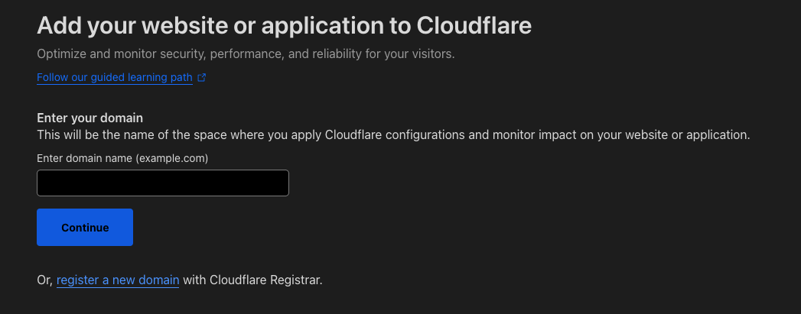
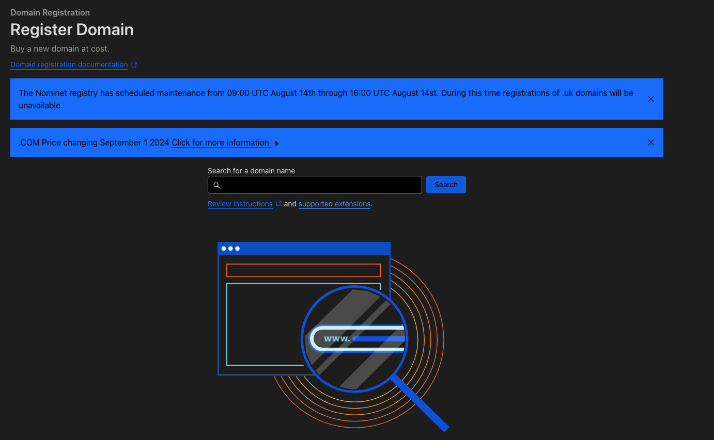
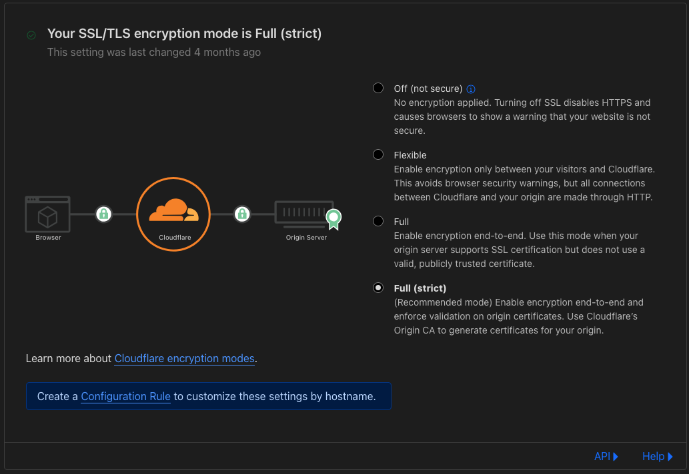
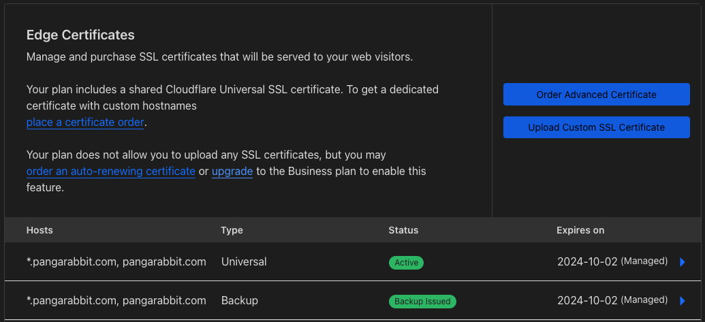

- [How to bake an Ortelius Pi Part 4 | Cloudflare, Certificates and Traefik](#how-to-bake-an-ortelius-pi-part-4--cloudflare-certificates-and-traefik)
  - [Introduction](#introduction)
  - [Roadmap](#roadmap)
  - [Cloudflare | Connectivity Cloud](#cloudflare--connectivity-cloud)
    - [Buying a domain name](#buying-a-domain-name)
    - [SSL/TLS](#ssltls)
  - [Traefik](#traefik)
    - [Helm-Release | Traefik](#helm-release--traefik)
    - [Manifest Folder | Traefik](#manifest-folder--traefik)

## How to bake an Ortelius Pi Part 4 | Cloudflare, Certificates and Traefik

### Introduction

In [part 3](https://ortelius.io/blog/2024/04/09/how-to-bake-an-ortelius-pi-part-3--the-gitops-configuration/), of this series we used the [GitOps Methodology](https://opengitops.dev/) to deploy the [Cert Manager](https://cert-manager.io/), [NFS CSI Driver](https://github.com/kubernetes-csi/csi-driver-nfs) for Kubernetes to connect to the Synology NAS for centralised dynamic volume storage, [Metallb Load Balancer](https://metallb.universe.tf/), [Traefik Proxy](https://traefik.io/) as the entrypoint for our Microservices and [Ortelius](https://ortelius.io/) the ultimate evidence store using [Gimlet](https://gimlet.io/) as the UI to our GitOps controller [Fluxcd](https://fluxcd.io/).

In part 4 we will setup [Cloudflare](https://www.cloudflare.com/en-gb/), [LetsEncrypt](https://letsencrypt.org/) and [Traefik](https://traefik.io) to secure our connections with certificates.

### Roadmap

I have tried to put things in a logical order for deployment like this:

`cloudflare --> secret store --> ZeroTier --> everything else`

### Cloudflare | Connectivity Cloud

You might know Cloudflare as a CDN but its so much more than that. Cloudflare is packed with amazing features and security offerings which are just to many to cover in this blog.

- [Documentation](https://developers.cloudflare.com/)
- [Learning Centre](https://www.cloudflare.com/en-gb/learning/)
- [Free Plan](https://www.cloudflare.com/plans/free/)

Cloudflare have kindly provided a free plan which we will use so the first thing you need to do is set up an account for yourself or if you have an account login.

#### Buying a domain name

- Now we need a dns domain so if you don't have one you will need to buy one which you can do through Cloudflare.

- Click on `Websites`


- Click on `Add a site`


- Click on `register a new domain`


- Click in the `Search for a domain name` box and find a domain


- Cloudflare will tell you if your domain is available. Unfortunately my cats name `mottles.com` was not available. She will not be impressed
- Pick your domain and brandish your credit card


- At the end of the process when get back to `Websites` you should see your new domain registered
- Here you can see my domain `pangarabbit.com`
- Click on our new domain and head over to `DNS`


- You should have 2 DNS A records like below | `* is for wildcard` and the domain apex `pangarabbit.com`
- The domain apex record should be there but you might have to add the wildcard if memory serves me correctly


#### SSL/TLS

- Lets head over to `SSL/TLS` now


- You will be faced with the following screen and you want to have `Full (strict)` enabled



- Below are some caveats to take note of which are taken from that little `Help` button

Why isn’t my site working over HTTPS?

Certificate provisioning typically takes around 15 minutes for paid plans and up to 24 hours for Free plans. Contact support if you do not have a certificate after that time. If the certificate is already “active” under the Edge Certificates tab, but you still cannot access your site over HTTPS, refer to the [troubleshooting documentation](https://developers.cloudflare.com/ssl/troubleshooting/).
What encryption mode should I use?

Cloudflare strongly recommends using Full or Full (strict) modes to prevent malicious connections to your origin. For details on each available mode, refer to the [encryption modes documentation](https://developers.cloudflare.com/ssl/origin-configuration/ssl-modes/).

- I turned this on


- Clicking on `Edge Certificates` you will see that the kind folks at Cloudflare have provided you with a certificate for free also known as `Universal SSL`

Attention: Let's Encrypt's chain of trust will be changing on September 2024. Universal SSL certificates will be automatically switched to a more compatible certificate authority. Review our [documentation](https://developers.cloudflare.com/ssl/reference/migration-guides/lets-encrypt-chain/#lets-encrypt-chain-update) for details and to understand the impacts on other certificate types.





- Enable `Always Use HTTPS`


- I set `Minimum TLS Version` to `TLS 1.3` for the best security


- I enabled `Opportunistic Encryption`


- I turned on `TLS 1.3` for the best security


- I turned on `Automatic HTTPS Rewrites`


### Traefik

#### Helm-Release | Traefik

- Lets go back to our Traefik Helm Release and make some amendments
- Edit `traefik.yaml` in the `helm-releases` directory with the following changes

#### Manifest Folder | Traefik

- The folks at Traefik put this nice piece of logic in the Helm Chart that allows you to create a config file which is dynamically monitored by Traefik
- I am using this to manage the Lets Encrypt certicate renewal in conjunction with Cloudflare
- Its time to `ENABLE` the certificate logic in `/manifests/traefik-dynamic-config.yaml` and `git push`
- Allow Flux to do its thing

```yaml
      file:
        # -- Create a file provider
        enabled: true
        # -- Allows Traefik to automatically watch for file changes
        watch: true
        # -- File content (YAML format, go template supported) (see https://doc.traefik.io/traefik/providers/file/)
        # content:
        providers:
          file:
            directory: /manifests/traefik-dynamic-config.yaml
```
- The logic in the `traefik-dynamic-config.yaml` would have created a `secret` with your Cloudflare API token and a `Issuer` for your certificate using `Certificate Manager`

- Run the following to see your created certificate

```shell
kubectl get certificates -owide -n infrastructure
```

- Mine is called `wildcard-pangarabbit-com-tls`


- Below I am showing the `ingressRoute` for the dashboard and you can see I only have `websecure` and I have added the `tls` configuration which matches `SECRET` as in the about image

```yaml
    ingressRoute:
      dashboard:
        # -- Create an IngressRoute for the dashboard
        enabled: true
        # -- Additional ingressRoute annotations (e.g. for kubernetes.io/ingress.class)
        annotations: {}
        # -- Additional ingressRoute labels (e.g. for filtering IngressRoute by custom labels)
        labels: {}
        # -- The router match rule used for the dashboard ingressRoute
        matchRule: Host(`traefik.pangarabbit.com`) #PathPrefix(`/dashboard`) || PathPrefix(`/api`)
        # -- Specify the allowed entrypoints to use for the dashboard ingress route, (e.g. traefik, web, websecure).
        # By default, it's using traefik entrypoint, which is not exposed.
        # /!\ Do not expose your dashboard without any protection over the internet /!\
        entryPoints: ["websecure"]
        # -- Additional ingressRoute middlewares (e.g. for authentication)
        middlewares: []
        # -- TLS options (e.g. secret containing certificate)
        tls:
          default:
            defaultCertificate:
              secretName: wildcard-pangarabbit-com-tls
      healthcheck:
        # -- Create an IngressRoute for the healthcheck probe
        enabled: false
        # -- Additional ingressRoute annotations (e.g. for kubernetes.io/ingress.class)
        annotations: {}
        # -- Additional ingressRoute labels (e.g. for filtering IngressRoute by custom labels)
        labels: {}
        # -- The router match rule used for the healthcheck ingressRoute
        matchRule: PathPrefix(`/ping`)
        # -- Specify the allowed entrypoints to use for the healthcheck ingress route, (e.g. traefik, web, websecure).
        # By default, it's using traefik entrypoint, which is not exposed.
        entryPoints: ["traefik"]
        # -- Additional ingressRoute middlewares (e.g. for authentication)
        middlewares: []
        # -- TLS options (e.g. secret containing certificate)
        tls: {}
```

- To enable the certificate for all the workloads behind Traefik you need to change the following in your `Helm Release` and make your certifcate the default

```yaml
    # -- TLS Store are created as [TLSStore CRDs](https://doc.traefik.io/traefik/https/tls/#default-certificate). This is useful if you want to set a default certificate. See EXAMPLE.md for details.
    tlsStore:
      default:
        defaultCertificate:
          secretName: wildcard-pangarabbit-com-tls
```